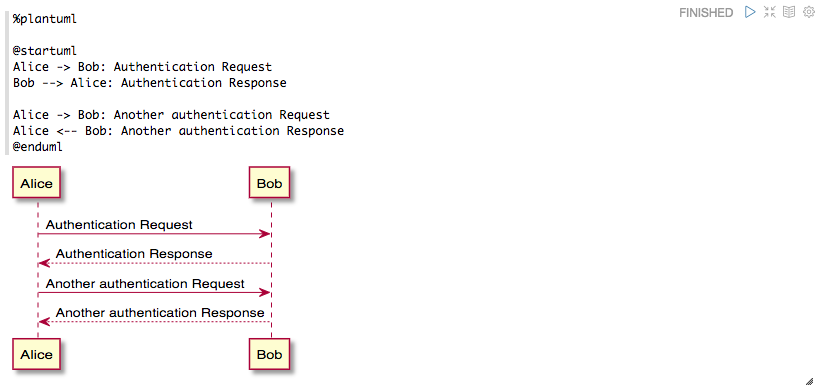
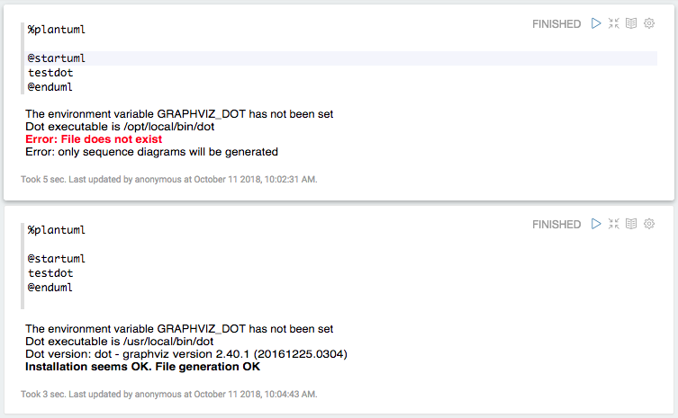

# zeppelin-interpreter-plantuml

An zeppelin interpreter for the [PlantUML](http://plantuml.com/). 

# Screenshots



# How to build

You should clone [zeppelin](https://github.com/apache/zeppelin) into your local drive. Assuming the directory is $ZEPPLIN_SRC, and your local zeppelin installation directory is $ZEPPLIN_BIN

Build Steps:

  - Clone this project into $ZEPPELIN_SRC\plantuml
  - Run mvn install in $ZEPPELIN_SRC\plantuml
  - Find $ZEPPELIN_SRC\interpreter\plantuml\ and copy the whole directory to $ZEPPELIN_BIN\interpreter\plantuml
  - Add following json to the interpreterSettings property in $ZEPPELIN_BIN\conf\interpreter.json . Or **Simply delete that file, it will be re-created by zeppelin on next startup.**

```json
    "plantuml": {
      "id": "plantuml",
      "name": "plantuml",
      "group": "plantuml",
      "properties": {
        "plantuml.render.timeout.millisecs": {
          "name": "plantuml.render.timeout.millisecs",
          "value": "60000",
          "type": "number"
        }
      },
      "status": "READY",
      "interpreterGroup": [
        {
          "name": "plantuml",
          "class": "org.apache.zeppelin.uml.PlantUMLInterpreter",
          "defaultInterpreter": false,
          "editor": {
            "language": "text",
            "editOnDblClick": false,
            "completionSupport": false
          }
        }
      ],
      "dependencies": [],
      "option": {
        "remote": true,
        "port": -1,
        "isExistingProcess": false,
        "setPermission": false,
        "owners": [],
        "isUserImpersonate": false
      }
    }
```

# Test your installation



# Branch/Version Matrix

| zeppelin-interpreter-plantuml branch | supported zeppelin version |
| ------------- | ------------- |
| master  | latest stable (0.8.0 as of Oct 10, 2018)  |
| branch-0.8.0  | 0.8.0  |
